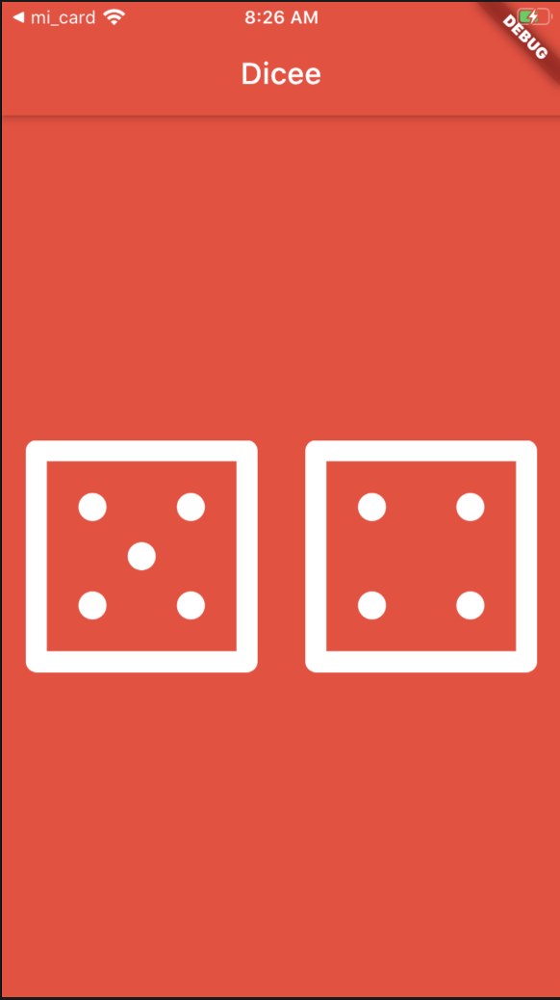

# Dicee

This is an app to practice flutter and put a random dicee when you click the correspondent dicee.

# How to run

```shell
cd dicee/
flutter run

```

Or do Fn + F5 if you're on mac notebook

# Final Result

You can see when you click the dicee, that will change to a random number. Image of the app:

View of the app



## Technologies

- Flutter
- Math dart

# Made By

- [Linkedin](https://br.linkedin.com/in/larissa-varj%C3%A3o-152932b8)
- [Website](http://larissavarjao.com/)
